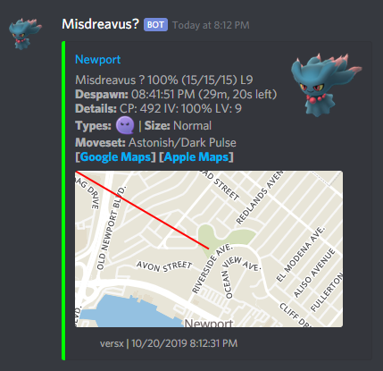
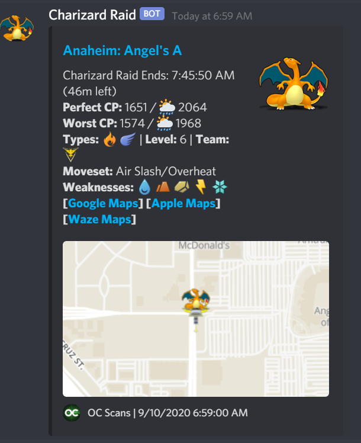
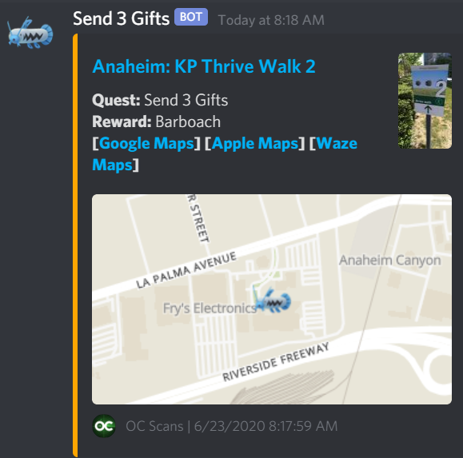
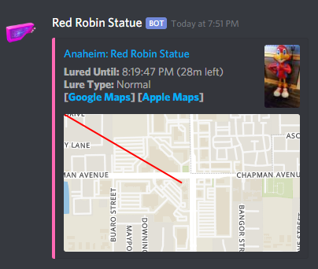
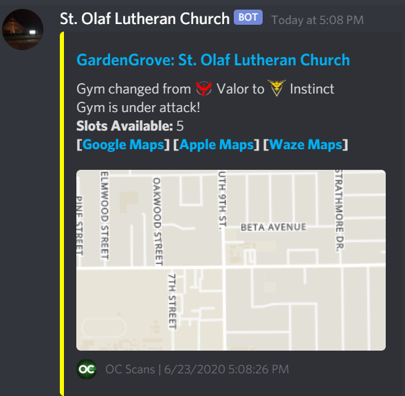
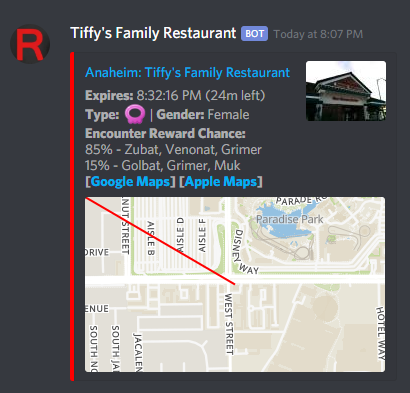

[](https://github.com/versx/WhMgr/actions)
[](https://whmgr.rtfd.io)
[](https://github.com/versx/WhMgr/releases/)
[](https://github.com/versx/WhMgr/graphs/contributors/)
[](https://discord.gg/zZ9h9Xa)  
# Webhook Manager v4  

### PokeAlarm, PoracleJS, WDR, Novabot, etc alternative.  
Works with [RealDeviceMap](https://github.com/123FLO321/RealDeviceMap)  


## Description:  
Sends Discord notifications based on pre-defined filters for Pokemon, raids, raid eggs, field research quests, Team Rocket invasions, gym team changes, and weather. Also supports Discord user's subscribing to Pokemon, raid, quest, and Team Rocket invasion notifications via DM.


## Features:  
- Supports multiple Discord servers.  
- Discord channel alarm reports for Pokemon, raids, eggs, quests, lures, invasions, gym team changes, and weather.  
- Per user custom Discord notifications for Pokemon, raids, quests, and invasions.  
- User interface to configure Discord notifications with ease (as well as Discord commands). (https://github.com/versx/WhMgr-UI)  
- Subscription notifications based on pre-defined distance.  
- Customizable alert messages with dynamic text replacement.  
- Support for multiple cities/areas using geofences per server.  
- Daily shiny stats reporting.  
- Automatic quest message purge at midnight.  
- Support for Donors/Supporters only notifications.  
- Direct messages of Pokemon notifications based on city roles assigned.  
- Pokemon and Raid subscription notifications based on specific forms.  
- Custom prefix support as well as mentionable user support for commands.  
- Raid subscription notifications for specific gyms.  
- Twilio text message alerts for ultra rare Pokemon.  
- Custom image support for Discord alarm reports.  
- Custom icon style selection for Discord user notifications.  
- External emoji server support.  
- Custom static map format support.  
- Support for language translation.  
- Multi threaded, low processing consumption.  
- [I.C.O.N.S.](https://github.com/Mygod/pokemon-icon-postprocessor) standard image support.
- Lots more...  

## Documentation:  
[ReadTheDocs](https://whmgr.rtfd.io/)  

## Terminology:  
- **Alerts:** Discord message structures for channel messages or direct message subscriptions
- **Subscriptions:** Custom user defined Pokemon, Raid, Quest, Invasion, or Gym direct messages subscriptions
- **Geofences:** Area restrictions per Alarm
- **Alarms:** Discord channel messages

## Getting Started:  

1.) Run the following to install .NET Core runtime, clone respository, and copy example Alerts, Filters, Geofences, config and alarm files.  
```
Linux/macOS:  
wget https://raw.githubusercontent.com/versx/WhMgr/master/install.sh && chmod +x install.sh && ./install.sh && rm install.sh  

Windows:  
bitsadmin /transfer dotnet-install-job /download /priority FOREGROUND https://raw.githubusercontent.com/versx/WhMgr/master/install.bat install.bat | start install.bat  
```
2.) Edit `config.json` either open in Notepad/++ or `vi config.json`.  
  - [Create bot token](https://github.com/reactiflux/discord-irc/wiki/Creating-a-discord-bot-&-getting-a-token)  
  - Input your bot token and config options.  
```js
{
    // Http listening interface for raw webhook data.
    "host": "10.0.0.10",
    // Http listener port for raw webhook data.
    "port": 8008,
    // Locale language translation
    "locale": "en",
    // ShortURL API (yourls.org API, i.e. `https://domain.com/yourls-api.php?signature=XXXXXX`)
    "shortUrlApiUrl": null,
    // Stripe API key (Stripe production API key, i.e. rk_3824802934
    "stripeApiKey": ""
    // List of Discord servers to connect and post webhook messages to.
    "servers": {
        // Discord server #1 guild ID (replace `000000000000000001` with guild id of server)
        "000000000000000001": {
            // Bot command prefix, leave blank to use @mention <command>
            "commandPrefix": ".",
            // Discord Emoji server ID. (Can be same as `guildId`)  
            "emojiGuildId": 000000000000000001,
            // Discord server owner ID.
            "ownerId": 000000000000000000,
            // Donor/Supporter role ID(s).
            "donorRoleIds": [
                000000000000000000
            ],
            // Moderator Discord role ID(s).
            "moderatorRoleIds": [
                000000000000000000
            ],
            // Discord bot token with user.
            "token": "<DISCORD_BOT_TOKEN>",
            // Alarms file path.
            "alarms": "alarms.json",
            // Custom user subscriptions
            "subscriptions": {
                // Enable or disable custom direct message notification subscriptions per user.
                "enabled": false,
                // Maximum amount of Pokemon subscriptions a user can set, set as 0 for no limit.
                "maxPokemonSubscriptions": 0,
                // Maximum amount of PvP subscriptions a user can set, set as 0 for no limit.
                "maxPvPSubscriptions": 0,
                // Maximum amount of Raid subscriptions a user can set, set as 0 for no limit.
                "maxRaidSubscriptions": 0,
                // Maximum amount of Quest subscriptions a user can set, set as 0 for no limit.
                "maxQuestSubscriptions": 0,
                // Maximum amount of Invasion subscriptions a user can set, set as 0 for no limit.
                "maxInvasionSubscriptions": 0,
                // Maximum amount of Gym subscriptions a user can set, set as 0 for no limit.
                "maxGymSubscriptions": 0
            },
            // Enable city role assignments.
            "enableCities": false,
            // City/geofence role(s) used to assign city roles (if enabled) as well as depict what
	    // geofences are related to which Discord guild. **NOT** used for subscriptions.
            "cityRoles": [
                "City1",
                "City2"
            ],
            // Assigning city roles requires Donor/Supporter role.
            "citiesRequireSupporterRole": true,
            // Prune old field research quests at midnight.
            "pruneQuestChannels": true,
            // Channel ID(s) of quest channels to prune at midnight.
            "questChannelIds": [
                000000000000000000
            ],
            // Channel ID to post nests.
            "nestsChannelId": 000000000000000000,
            // Minimum amount of average spawn count per hour for nest to post
            "nestsMinimumPerHour": 2,
            // Shiny stats configuration
            "shinyStats": {
                // Enable shiny stats posting.
                "enabled": true,
                // Clear previous shiny stat messages.
                "clearMessages": false,
                // Channel ID to post shiny stats.
                "channelId": 000000000000000000
            },
            // Icon style to use.
            "iconStyle": "Default",
            // Channel ID(s) bot commands can be executed in.
            "botChannelIds": [
                000000000000000000
            ],
            // Custom Discord status per server, leave blank or null to use current version.  
            "status": ""
        },
        "000000000000000002": {
            "commandPrefix": ".",
            "emojiGuildId": 000000000000000001,
            "ownerId": 000000000000000000,
            "donorRoleIds": [
                000000000000000000
            ],
            "moderatorRoleIds": [
                000000000000000000
            ],
            "token": "<DISCORD_BOT_TOKEN>",
            "alarms": "alarms2.json",
            // Custom user subscriptions
            "subscriptions": {
                // Enable or disable custom direct message notification subscriptions per user.
                "enabled": false,
                // Maximum amount of Pokemon subscriptions a user can set, set as 0 for no limit.
                "maxPokemonSubscriptions": 0,
                // Maximum amount of PvP subscriptions a user can set, set as 0 for no limit.
                "maxPvPSubscriptions": 0,
                // Maximum amount of Raid subscriptions a user can set, set as 0 for no limit.
                "maxRaidSubscriptions": 0,
                // Maximum amount of Quest subscriptions a user can set, set as 0 for no limit.
                "maxQuestSubscriptions": 0,
                // Maximum amount of Invasion subscriptions a user can set, set as 0 for no limit.
                "maxInvasionSubscriptions": 0,
                // Maximum amount of Gym subscriptions a user can set, set as 0 for no limit.
                "maxGymSubscriptions": 0
            },
            "enableCities": false,
            "cityRoles": [
                "City3",
                "City4"
            ],
            "citiesRequireSupporterRole": true,
            "pruneQuestChannels": true,
            "questChannelIds": [
                000000000000000000
            ],
            "nestsChannelId": 000000000000000000,
            "nestsMinimumPerHour": 2,
            "shinyStats": {
                "enabled": true,
                "clearMessages": false,
                "channelId": 000000000000000000
            },
            "iconStyle": "Default",
            "botChannelIds": [
                000000000000000000
            ],
            "status": null
        }
    },
    // Database configuration
    "database": {
        // Database to store notification subscriptions.
        "main": {
            // Database hostname or IP address.
            "host": "127.0.0.1",
            // Database connection port.
            "port": 3306,
            // Database user account name.
            "username": "root",
            // Database user account password.
            "password": "password",
            // Brock database name.
            "database": "brock3"
        },
        // Scanner database config
        "scanner": {
            // Database hostname or IP address.
            "host": "127.0.0.1",
            // Database connection port.
            "port": 3306,
            // Database user account name.
            "username": "root",
            // Database user account password.
            "password": "password",
            // RDM database name.
            "database": "rdmdb"
        },
        // PMSF Nests database config
        "nests": {
            // Database hostname or IP address.
            "host": "127.0.0.1",
            // Database connection port.
            "port": 3306,
            // Database user account name.
            "username": "root",
            // Database user account password.
            "password": "password",
            // PMSF nests database name.
            "database": "manualdb"
        }
    },
    // List of Pokemon IDs to treat as event and restrict postings and subscriptions to 90% IV or higher. (Filled in automatically with `event set` command)  
    "eventPokemonIds": [
        129,
        456,
        320
    ],
	// Minimum IV value for an event Pokemon to have to meet in order to post via Discord channel alarm or direct message subscription.
    "eventMinimumIV": "90",
    // Image URL config
    "urls": {
        // Static tile map images template.
        "staticMap": "http://tiles.example.com:8080/static/klokantech-basic/{0}/{1}/15/300/175/1/png",
        // Scanner map DTS option for embeds as `scanmaps_url`  
        "scannerMap": "http://map.example.com/@/{0}/{1}/15"
    },
    // Available icon styles
    "iconStyles": {
        "Default": "https://raw.githubusercontent.com/versx/WhMgr-Assets/master/original/",
        "Shuffle": "https://raw.githubusercontent.com/versx/WhMgr-Assets/master/shuffle/",
        "Home": "https://raw.githubusercontent.com/nileplumb/PkmnHomeIcons/master/pmsf_OS_128/"
    },
    // Custom static map template files for each alarm type
    "staticMaps": {
        // Static map template for Pokemon
        "pokemon": "pokemon.example.json",
        // Static map template for Raids and Eggs
        "raids": "raids.example.json",
        // Static map template for field research quests
        "quests": "quests.example.json",
        // Static map template for Team Rocket invasions
        "invasions": "invasions.example.json",
        // Static map template for Pokestop lures
        "lures": "lures.example.json",
        // Static map template for Gym team control changes
        "gyms": "gyms.example.json",
        // Static map template for nest postings
        "nests": "nests.example.json",
        // Static map template for weather changes
        "weather": "weather.example.json"
    },
    // Get text message alerts with Twilio.com
    "twilio": {
        // Determines if text message alerts are enabled
        "enabled": false,
        // Twilio account SID (Get via Twilio dashboard)
        "accountSid": "",
        // Twilio account auth token (Get via Twilio dashboard)
        "authToken": "",
        // Twilio phone number that will be sending the text message alert
        "from": "",
        // List of Discord user ids that can receive text message alerts
        "userIds": [],
        // List of acceptable Pokemon to receive text message alerts for
        "pokemonIds": [201, 480, 481, 482, 443, 444, 445, 633, 634, 635, 610, 611, 612],
        // Minimum acceptable IV value for Pokemon if not ultra rare (Unown, Lake Trio)
        "minIV": 100
    },
    // Needed if you want to use the address lookup DTS
    "gmapsKey": "",
    // Minimum despawn time in minutes a Pokemon must have in order to send the alarm (default: 5 minutes)
    "despawnTimeMinimumMinutes": 5,
    // Log webhook payloads to a file for debugging (do not enable unless you're having issues receiving data
    "debug": false,
    // Only show logs with higher or equal priority levels (Trace, Debug, Info, Warning, Error, Fatal, None)
    "logLevel": "Trace"
}
```
3.) Edit `alarms.json` either open in Notepad/++ or `vi alarms.json`.  
4.) Fill out the alarms file.  
```js
{
    //Global switch for Pokemon notifications.
    "enablePokemon": false,
  
    //Global switch for Raid/Egg notifications.
    "enableRaids": false,
  
    //Global switch for Quest notifications.
    "enableQuests": false,
  
    //Global switch for Pokestop notifications.
    "enablePokestops": false,
  
    //Global switch for Gym notifications.
    "enableGyms": false,
    
    //Global switch for Weather notifications.
    "enableWeather": false,
  
    //List of alarms
    "alarms": [{
        //Alarm name.
        "name":"Alarm1",
        
        //DTS compatible mention description.      
        "description":"<!@324234324> <iv> L<lvl> <geofence>",
      
        //Alerts file.
        "alerts":"default.json",
      
        //Alarm filters.
        "filters":"default.json",
      
        //Path to geofence file.
        "geofence":"geofence1.txt",
    
        //Discord webhook url address.
        "webhook":"<DISCORD_WEBHOOK_URL>"
    },{
        //Alarm name.
        "name":"Alarm2",
        
        //DTS compatible mention description.      
        "description":"",
      
        //Alerts file.
        "alerts":"default.json",
      
        //Alarm filters.
        "filters":"100iv.json",
      
        //Path to geofence file.
        "geofence":"geofence1.txt",
      
        //Discord webhook url address.
        "webhook":"<DISCORD_WEBHOOK_URL>"
    }]
}
```
5.) Create directory `geofences` in `bin/debug/netcoreapp2.1` directory if it doesn't already exist.  
6.) Create/copy geofence files to `geofences` folder.  

*Note:* Geofence file format is the following:  
```ini
[City1]
34.00,-117.00
34.01,-117.01
34.02,-117.02
34.03,-117.03
[City2]
33.00,-118.00
33.01,-118.01
33.02,-118.02
33.03,-118.03
```
**GeoJSON to individual INI format geofence files converter:** https://gist.github.com/versx/a0915c6bd95a080b6ff60cd539d4feb6  
7.) Add dotnet to your environment path if it isn't already (optional): `export PATH=~/.dotnet/dotnet:$PATH`  
8.) Build executable `dotnet build ../../..` (if dotnet is in your path) otherwise `~/.dotnet/dotnet build ../../..`  
9.) Start WhMgr `dotnet WhMgr.dll` (if dotnet is in your path) otherwise `~/.dotnet/dotnet WhMgr.dll` (If Windows, run as Administrator)  
10.) Optional User Interface for members to create subscriptions from a website instead of using Discord commands. [WhMgr UI](https://github.com/versx/WhMgr-UI)  
11.) Optional reverse location lookup with OpenStreetMaps Nominatim instead of Google Maps, install instructions [here](https://nominatim.org/release-docs/develop/admin/Installation/)  

## Updating  
1. Pull latest changes in root folder  
1. Build project `dotnet build`  
1. Run `dotnet bin/debug/netcoreapp2.1/WhMgr.dll`  

**Important Notes:**  
- Upon starting, database tables will be automatically created if `enableSubscriptions` is set to `true`. Emoji icons are also created in the specified `EmojiGuildId` upon connecting to Discord.  
- Discord Permissions Needed:  
  * Read Messages  
  * Send Messages  
  * Manage Messages (Prune quest channels)  
  * Manage Roles (If cities are enabled)  
  * Manage Emojis  
  * Embed Links  
  * Attach Files (`export` command)  
  * Use External Emojis  
- DM notifications can be sent to users based on:  
    - Pokemon ID  
    - Pokemon Form  
    - Pokemon IV  
    - Pokemon Level  
    - List of Pokemon Attack/Defense/Stamina values  
    - Pokemon Gender  
    - Raid Boss  
    - City  
    - Gym Name  
    - Quest Reward  
    - Invasion Grunt Type  
    - Distance (meters)  

## Notification Commands
**General Subscription Commands**  

* `enable` Enable direct message subscriptions  
* `disable` Disable direct message subscriptions  
* `info` List all Pokemon, Raid, Quest, Invasion, and Gym subscriptions and settings  
* `set-distance`  Set minimum distance to Pokemon, PvP, raids, quests, invasions and gyms need to be within. (Measured in meters) If a distance is set, subscribed geofences will be ignored.  
* `expire` / `expires` Check stripe API when Donor/Supporter subscription expires  
* `set-number` Sets the phone number to use for text message alerts for ultra rare Pokemon  

**Pokemon Subscriptions**  
* `pokeme` Subscribe to specific Pokemon notifications  
* `pokemenot` Unsubscribe from specific Pokemon notifications

**PVP Subscriptions**  
* `pvpme` Subscription to specific PVP Pokemon notifications
* `pvpmenot` Unsubscribe from specific PVP Pokemon notifications

**Raid Subscriptions**  
* `raidme` Subscribe to specific Raid notifications
* `raidmenot` Unsubscribe from specific Raid notifications

**Quest Subscriptions**  
* `questme` Subscribe to specific field research quest notifications
* `questmenot` Unsubscribe from specific field research quest notifications

**Team Rocket Invasion Subscriptions**  
* `invme` Subscribe to specific Team Rocket invasion notifications
* `invmenot` Unsubscribe from specific Team Rocket invasion notifications

**Subscriptions Management**  
* `import`  Import saved subscriptions file  
* `export`  Export subscriptions config file  

**Icon Style Selection**  
* `icons`  List available icon styles to choose from  
* `set-icons` Set icon style to use for direct message notifications  

**City Role Assignment**  
* `cities` / `feeds` List all available city roles  
* `feedme` Assign city role   
* `feedmenot` Unassign city role  

## Owner Only Commands  
* `gyms convert` Check for any pokestops that have converted to gyms and delete them from the database.  
* `nests` Post nests in channels.  
* `event list` List Pokemon set as event Pokemon  
* `event set <pokemon_id_list>` Set Pokemon as event Pokemon (overwrites current list)  
* `isbanned` Check if IP banned from PTC or NIA  
* `clean-departed` Clean departed Discord member subscriptions  
* `reset-quests` Reset and delete quest channels  
* `shiny-stats` Manually post shiny stats  

## Dynamic Text Replacement  
__**Pokemon**__  

| Place Holder | Description  | Example
|---|---|---|  
| pkmn_id  | Pokedex ID  |  1
| pkmn_id_3  | Pokedex ID (always 3 digits)  | 001
| pkmn_name | Pokemon name | Bulbasaur
| pkmn_img_url | Pokemon image url | http://example.com/your-specified-pokemon-url
| form | Pokemon form name | Alolan
| form_id | Form ID | 65
| form_id_3 | Form ID (always 3 digits) | 065
| costume | Costume name | Witch Hat
| costume_id | Costume ID | 835
| costume_id_3 | Costume ID (always 3 digits) | 835
| cp | Combat Power value | 1525
| lvl | Pokemon level | 25
| gender | Pokemon gender | Gender icon
| gender_emoji | Pokemon gender emoji | <:00000:gender_male>
| size | Pokemon size | Big
| move_1 | Fast move name | Quick Attack
| move_2 | Charge move name | Thunder
| moveset | Fast & Charge move names | Quick Attack/Thunder
| type_1 | Pokemon type | Dark
| type_2 | Pokemon type | Water
| type_1_emoji | Pokemon type emoji | <:00000:types_water>
| type_2_emoji | Pokemon type emoji | <:00000:types_rock>
| types | Both types (if 2nd exists) | Dark/Fire
| types_emoji | Type Discord emoji | <:00000:types_fire> <00001:types_dark>
| atk_iv | Attack IV stat | 15
| def_iv | Defense IV stat | 7
| sta_iv | Stamina IV stat | 13
| iv | IV stat (including percent sign) | 100%
| iv_rnd | Rounded IV stat | 96%
| is_great | Great League stats (bool) | true
| is_ultra | Ultra League stats (bool) | false
| is_pvp | Has either Great or Ultra league stats | true
| great_league_emoji | Great League emoji icon | <000000:league_great>
| ultra_league_emoji | Ultra League emoji icon | <000000:league_ultra>
| pvp_stats | PvP stat ranking strings | 
| height | Pokemon height | 0.79
| weight | Pokemon weight | 116
| is_ditto | Checks if Ditto | true
| original_pkmn_id | Pokedex ID of Ditto disguise | 13
| original_pkmn_id_3 | Pokedex ID of Ditto disguise (always 3 digits) | 013
| original_pkmn_name | Pokemon name of Ditto diguise | Weedle
| is_weather_boosted | Returns if Pokemon is weather boosted | true
| has_weather | Returns if Pokemon data has weather | false
| weather | Weather in-game name | PartlyCloudy
| weather_emoji | Weather in-game emoji | Weather
| username | Account username of account that found Pokemon | Frank0324
| spawnpoint_id | Spawnpoint ID Pokemon near | 3920849203840983204980
| encounter_id | Encounter ID of Pokemon | 392874987239487924
| despawn_time | Pokemon despawn time | 07:33:01 PM
| despawn_time_24h | Pokemon despawn time (24-hour format) | 19:33:01
| despawn_time_verified | Indicates if time is confirmed or not | `~` for not verified
| is_despawn_time_verified | Returns if despawn time is verified | true
| time_left | Minutes and seconds of time left until despawn | 29m, 30s
| geofence | Geofence name Pokemon is in | City1
| lat | Latitude coordinate of Pokemon location | 5.980921321
| lng | Longitude coordinate of Pokemon location | 3.109283009
| lat_5 | Latitude coordinate shortend to 5th precision | 5.98092
| lng_5 | Longitude coordinate shortend to 5th precision | 3.10928
| tilemaps_url | Static tile map url | http://tiles.example.com/static/pokemon-1.png
| gmaps_url | Google maps location url | https://maps.google.com/maps?q=5.980921321,3.109283009
| applemaps_url | Apple maps location url | https://maps.apple.com/maps?daddr=5.980921321,3.109283009
| wazemaps_url | Waze maps location url | https://www.waze.com/ul?ll=5.980921321,3.109283009&navigate=yes
| near_pokestop | Returns if Pokemon is near a Pokestop | true
| pokestop_id | Nearby Pokestop ID | 9382498723849792348798234.16
| pokestop_name | Name of nearby Pokestop | The Amazing Pokestop
| pokestop_url | Image url of nearby Pokestop | https://google.com/imgs/gym.png
| guild_name | Name of Guild | Test Guild
| guild_img_url | Icon image url of Guild | https://discordapp.com/image1.png
| date_time | Current date and time | 12/12/2020 12:12:12 PM
| br | Newline break | `\r\n`

__**Raids & Eggs**__  

| Place Holder | Description  | Example
|---|---|---|  
| pkmn_id  | Raid boss pokedex ID  |  1
| pkmn_id_3  | Raid boss pokedex ID (always 3 digits)  | 001
| pkmn_name | Raid boss pokemon name | Bulbasaur
| pkmn_img_url | Raid boss pokemon image url | http://example.com/your-specified-pokemon-url
| form | Pokemon form name | Alolan
| form_id | Form ID | 65
| form_id_3 | Form ID (always 3 digits) | 065
| is_egg | Returns if raid is egg and not hatched | false
| is_ex | Returns if raid is ex pass eligible | true
| ex_emoji | Ex emoji icon | Ex
| team | Team name that has gym control | Valor
| team_emoji | Emoji of team that has gym control | <:valor:930824>
| cp | Raid boss combat power value | 36150
| lvl | Raid boss level | 5
| gender | Pokemon gender | Gender icon
| move_1 | Fast move name | Quick Attack
| move_2 | Charge move name | Thunder
| moveset | Fast & Charge move names | Quick Attack/Thunder
| type_1 | Pokemon type | Dark
| type_2 | Pokemon type | Water
| type_1_emoji | Pokemon type emoji | <:00000:types_water>
| type_2_emoji | Pokemon type emoji | <:00000:types_rock>
| types | Both types (if 2nd exists) | Dark/Fire
| types_emoji | Type Discord emoji | <:00000:types_fire> <00001:types_dark>
| weaknesses | Raid boss weaknesses | Rock, Ground, Dark
| weaknesses_emoji | Emoji(s) of raid boss weaknesses | Rock Ground Dark
| perfect_cp | Perfect IV CP | 1831
| perfect_cp_boosted | Perfect IV CP if Weather boosted | 2351
| worst_cp | Worst IV CP | 1530 
| worst_cp_boosted | Worst IV CP if Weather boosted | 1339
| start_time | Raid start time | 08:32:00 AM
| start_time_24h | Raid start time (24-hour format) | 08:32:00
| start_time_left | Time left until raid starts | 43m, 33s
| end_time | Raid end time | 09:15:10 AM
| end_time_24h | Raid end time (24-hour format) | 09:15:10
| end_time_left | Time left until raid ends | 45, 11s
| time_left | Minutes and seconds of time left until despawn | 29m, 30s
| geofence | Geofence name raid boss is in | City1
| lat | Latitude coordinate of Pokemon location | 5.980921321
| lng | Longitude coordinate of Pokemon location | 3.109283009
| lat_5 | Latitude coordinate shortend to 5th precision | 5.98092
| lng_5 | Longitude coordinate shortend to 5th precision | 3.10928
| tilemaps_url | Static tile map url | http://tiles.example.com/static/pokemon-1.png
| gmaps_url | Google maps location url | https://maps.google.com/maps?q=5.980921321,3.109283009
| applemaps_url | Apple maps location url | https://maps.apple.com/maps?daddr=5.980921321,3.109283009
| wazemaps_url | Waze maps location url | https://www.waze.com/ul?ll=5.980921321,3.109283009&navigate=yes
| gym_id | Gym ID | 9382498723849792348798234.16
| gym_name | Name of Gym | The Amazing Gym
| gym_url | Image url of Gym | https://google.com/imgs/gym.png
| guild_name | Name of Guild | Test Guild
| guild_img_url | Icon image url of Guild | https://discordapp.com/image1.png
| date_time | Current date and time | 12/12/2020 12:12:12 PM
| br | Newline break | `\r\n`

__**Quests**__  

| Place Holder | Description  | Example
|---|---|---|  
| quest_task | Quest task message | Catch 5 Pokemon
| quest_conditions | Quest task conditions | Dark
| quest_reward | Quest task reward | Chansey
| quest_reward_img_url | Quest reward image url | http://map.example.com/images/quest.png
| has_quest_conditions | Returns if the quest has conditions | true
| is_ditto | Checks if Ditto | true
| is_shiny | Checks if reward is shiny | false
| geofence | Geofence name raid boss is in | City1
| lat | Latitude coordinate of Pokemon location | 5.980921321
| lng | Longitude coordinate of Pokemon location | 3.109283009
| lat_5 | Latitude coordinate shortend to 5th precision | 5.98092
| lng_5 | Longitude coordinate shortend to 5th precision | 3.10928
| tilemaps_url | Static tile map url | http://tiles.example.com/static/pokemon-1.png
| gmaps_url | Google maps location url | https://maps.google.com/maps?q=5.980921321,3.109283009
| applemaps_url | Apple maps location url | https://maps.apple.com/maps?daddr=5.980921321,3.109283009
| wazemaps_url | Waze maps location url | https://www.waze.com/ul?ll=5.980921321,3.109283009&navigate=yes
| pokestop_id | Pokestop ID | 9382498723849792348798234.16
| pokestop_name | Name of Pokestop | The Amazing Pokestop
| pokestop_url | Image url of Gym | https://google.com/imgs/gym.png
| guild_name | Name of Guild | Test Guild
| guild_img_url | Icon image url of Guild | https://discordapp.com/image1.png
| date_time | Current date and time | 12/12/2020 12:12:12 PM
| br | Newline break | `\r\n`

**Pokestops**  

| Place Holder | Description  | Example
|---|---|---|  
| has_lure | Returns if Pokestop has active lure module deployed | true
| lure_type | Pokestop lure module type | Glacial
| lure_expire_time | Time lure module will expire | 07:33:19 PM
| lure_expire_time_24h | Time lure module will expire (24-hour format) | 19:33:19
| lure_expire_time_left | Time left until lure module expires | 13m, 2s
| has_invasion | Returns if Pokestop has active Team Rocket invasion | false
| grunt_type | Grunt type | Water
| grunt_type_emoji | Emoji icon of grunt type | <:938294:types_water>
| grunt_gender | Grunt gender | Male
| invasion_expire_time | Time the invasion expires | 02:17:11 PM
| invasion_expire_time_24h | Time the invasion expires (24-hour format) | 14:17:11
| invasion_expire_time_left | Time left until invasion expires | 12m, 56s
| invasion_encounters | Possible invasions reward encounters | 80% Bulbasaur
| geofence | Geofence name raid boss is in | City1
| lat | Latitude coordinate of Pokemon location | 5.980921321
| lng | Longitude coordinate of Pokemon location | 3.109283009
| lat_5 | Latitude coordinate shortend to 5th precision | 5.98092
| lng_5 | Longitude coordinate shortend to 5th precision | 3.10928
| tilemaps_url | Static tile map url | http://tiles.example.com/static/pokemon-1.png
| gmaps_url | Google maps location url | https://maps.google.com/maps?q=5.980921321,3.109283009
| applemaps_url | Apple maps location url | https://maps.apple.com/maps?daddr=5.980921321,3.109283009
| wazemaps_url | Waze maps location url | https://www.waze.com/ul?ll=5.980921321,3.109283009&navigate=yes
| pokestop_id | Pokestop ID | 9382498723849792348798234.16
| pokestop_name | Name of Pokestop | The Amazing Pokestop
| pokestop_url | Image url of Gym | https://google.com/imgs/gym.png
| lure_img_url | Image url of lure icon | https://google.com/imgs/lure_501.png
| invasion_img_url | Image url of grunt type icon | https://google.com/imgs/grunt_50.png
| guild_name | Name of Guild | Test Guild
| guild_img_url | Icon image url of Guild | https://discordapp.com/image1.png
| date_time | Current date and time | 12/12/2020 12:12:12 PM
| br | Newline break | `\r\n`

**Gyms**  

| Place Holder | Description  | Example
|---|---|---|  
| gym_id | Gym ID | 032840982304982034.16
| gym_name | Name of Gym | The Amazing Gym
| gym_url | Image url of Gym | https://google.com/imgs/gym.png
| gym_team | Current team that has gym control | Valor
| gym_team_emoji | Emoji icon of current team that has gym control | <:09833:valor>
| old_gym_team | Previous gym team that had gym control | Mystic
| old_gym_team_emoji | Emoji icon of previous gym team that has gym control | <:324987:mystic>
| team_changed | Returns if team's gym control changed | true
| in_battle | Returns if there's a current battle at the gym taking place | false
| under_attack | Returns if there's a current battle at the gym taking place | false
| is_ex | Returns if the gym is an ex raid eligible location | true
| ex_emoji | Ex emoji icon | <:809809:ex>
| slots_available | Number of available gym slots | 3
| geofence | Geofence name raid boss is in | City1
| lat | Latitude coordinate of Pokemon location | 5.980921321
| lng | Longitude coordinate of Pokemon location | 3.109283009
| lat_5 | Latitude coordinate shortend to 5th precision | 5.98092
| lng_5 | Longitude coordinate shortend to 5th precision | 3.10928
| tilemaps_url | Static tile map url | http://tiles.example.com/static/pokemon-1.png
| gmaps_url | Google maps location url | https://maps.google.com/maps?q=5.980921321,3.109283009
| applemaps_url | Apple maps location url | https://maps.apple.com/maps?daddr=5.980921321,3.109283009
| wazemaps_url | Waze maps location url | https://www.waze.com/ul?ll=5.980921321,3.109283009&navigate=yes
| guild_name | Name of Guild | Test Guild
| guild_img_url | Icon image url of Guild | https://discordapp.com/image1.png
| date_time | Current date and time | 12/12/2020 12:12:12 PM
| br | Newline break | `\r\n`

**Nests**  

| Place Holder | Description  | Example
|---|---|---|  
| pkmn_id  | Pokedex ID  |  1
| pkmn_id_3  | Pokedex ID (always 3 digits)  | 001
| pkmn_name | Pokemon name | Bulbasaur
| pkmn_img_url | Pokemon image url | http://example.com/your-specified-pokemon-url
| avg_spawns | Average amount of spawns in the nests | 34
| nest_name | Nest/Park name | Best Park Ever
| type_1 | Pokemon type | Dark
| type_2 | Pokemon type | Water
| type_1_emoji | Pokemon type emoji | <:00000:types_water>
| type_2_emoji | Pokemon type emoji | <:00000:types_rock>
| types | Both types (if 2nd exists) | Dark/Fire
| types_emoji | Type Discord emoji | <:00000:types_fire> <00001:types_dark>
| geofence | Geofence name nest/park is in | City1
| lat | Latitude coordinate of Pokemon location | 5.980921321
| lng | Longitude coordinate of S2Cell weather location | 3.109283009
| lat_5 | Latitude coordinate shortend to 5th precision | 5.98092
| lng_5 | Longitude coordinate shortend to 5th precision | 3.10928
| tilemaps_url | Static tile map url | http://tiles.example.com/static/pokemon-1.png
| gmaps_url | Google maps location url | https://maps.google.com/maps?q=5.980921321,3.109283009
| applemaps_url | Apple maps location url | https://maps.apple.com/maps?daddr=5.980921321,3.109283009
| wazemaps_url | Waze maps location url | https://www.waze.com/ul?ll=5.980921321,3.109283009&navigate=yes
| date_time | Current date and time | 12/12/2020 12:12:12 PM
| br | Newline break | `\r\n`


**Weather**  

| Place Holder | Description  | Example
|---|---|---|  
| id | S2Cell weather id | -9938028402
| weather_condition | In-game gameplay condition | Cloudy
| has_weather | Returns if there is weather set | true
| weather | In-game gameplay condition | Cloudy
| weather_img_url | Weather type image url | http://google.com/imgs/weather_1.png
| wind_direction | Wind blowing direction | true
| wind_level | Wind level | 285
| rain_level | Raid level | 285
| cloud_level | Cloud level | 285
| fog_level | Fog level | 285
| snow_level | Snow level | 285
| warn_weather | Warning weather | true
| special_effect_level | Special effect level | 2
| severity | Weather severity | None/Moderate/Extreme
| geofence | Geofence name weather cell is in | City1
| lat | Latitude coordinate of S2Cell weather location | 5.980921321
| lng | Longitude coordinate of S2Cell weather location | 3.109283009
| lat_5 | Latitude coordinate shortend to 5th precision | 5.98092
| lng_5 | Longitude coordinate shortend to 5th precision | 3.10928
| tilemaps_url | Static tile map url | http://tiles.example.com/static/pokemon-1.png
| gmaps_url | Google maps location url | https://maps.google.com/maps?q=5.980921321,3.109283009
| applemaps_url | Apple maps location url | https://maps.apple.com/maps?daddr=5.980921321,3.109283009
| wazemaps_url | Waze maps location url | https://www.waze.com/ul?ll=5.980921321,3.109283009&navigate=yes
| guild_name | Name of Guild | Test Guild
| guild_img_url | Icon image url of Guild | https://discordapp.com/image1.png
| date_time | Current date and time | 12/12/2020 12:12:12 PM
| br | Newline break | `\r\n`


## TODO  
- Allow Pokemon id and name in Pokemon filter lists.  
- Individual filters per Pokemon. (PA style, maybe)  
- PvP ranks DTS
- Separate subscriptions DTS
- Wiki.  


## Previews  
*All examples are completely customizable using Dynamic Text Replacement/Substitution*  
Discord Pokemon Notifications:  
  

Discord Pokemon PVP Notifications:  
  

Discord Raid Notifications:  
  

Discord Raid Egg Notifications:  
  

Discord Quest Notifications:  
  

Discord Lure Notifications:  
  

Discord Lure (Glacial) Notifications:  
 Notifications")  

Discord Lure (Mossy) Notifications:  
 Notifications")  

Discord Lure (Magnetic) Notifications:  
 Notifications")  

Discord Gym Team Takeover Notifications:  
  

Discord Team Rocket Invasion Notifications:  
  

Discord Weather Notifications:  
  


## Current Issues  
- Pokemon subscriptions are based on Discord city roles assigned currently, soon it will be based on specified cities.  

## Credits  
[versx](https://github.com/versx) - Developer  
[PokeAlarm](https://github.com/PokeAlarm/PokeAlarm) - Dynamic Text Substitution idea  
[WDR](https://github.com/PartTimeJS/WDR) - masterfile.json file  
