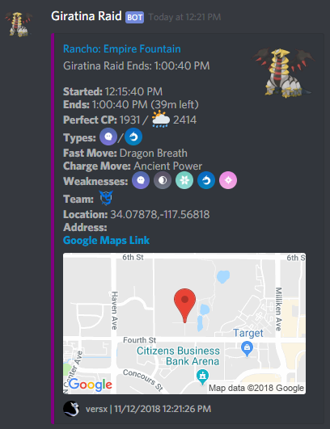
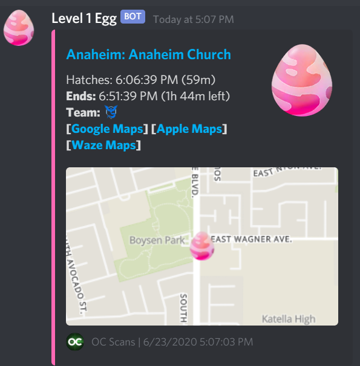

# Brock Webhook Manager

### PokeAlarm alternative.  
Works with [RealDeviceMap](https://github.com/123FLO321/RealDeviceMap)  


## Description:  
Sends Discord notifications based on pre-defined filters for Pokemon, raids, raid eggs, and field research quests. Also supports Discord user's subscribing to Pokemon, raid, or quest notifications via DM.


## Features:  
- Discord channel alarm reports for Pokemon, raids, eggs, quests, lures, and invasions.  
- Per user custom Discord notifications for Pokemon, raids, quests, and invasions.  
- Customizable alert messages with dynamic text replacement.  
- Support for multiple cities/areas using roles and geofences.  
- Daily shiny stats reporting.  
- Automatic quest message purge at midnight.  
- Support for Donors/Supporters only notifications.  
- Direct messages of Pokemon notifications based on city roles assigned.  
- Custom prefix support as well as mentionable user support for commands.  
- Custom image support for Discord alarm reports.  
- Custom icon style selection for Discord user notifications.  
- Lots more...  

## Getting Started:  

1.) Copy `config.example.json` to `config.json`.  
  a.) Create bot token.  
  b.) Input your bot token and config options. [Create bot token](https://github.com/reactiflux/discord-irc/wiki/Creating-a-discord-bot-&-getting-a-token)  
```
{
  "servers": [{
  }
  //Discord bot token with user.
  "token": "<DISCORD_BOT_TOKEN>",
  
  //Discord server owner id.
  "ownerId": 000000000000,
  
  //Discord server donator role id.
  "donorRoleIds": [000000000000, 000000000001],
  
  //List of Discord server moderator role ids.
  "moderators": [000000000000],
  
  //Discord server guild id.
  "guildId": 000000000000,
  
  //Listening port to accept webhook data.
  "webhookPort": 8002,
  
  //Enable discord user subscriptions for custom notifications to Quests/Raids/Pokemon, if enabled database information is required below.
  "enableSubscriptions": false,
  
  //MySQL database connection string.
  "connectionString": "Uid=user;Password=password;Server=127.0.0.1;Port=3306;Database=brockdb",
  
  //MySQL database connection string for RealDeviceMap scanner.
  "scannerConnectionString": "Uid=user;Password=password;Server=127.0.0.1;Port=3306;Database=brockdb",
  
  //City roles to filter by geofence.
  "cityRoles": [
    "City1",
    "City2"
  ],
  
  //Assigning city roles require a donor role.
  "citiesRequireSupporterRole": false,
  
  //Bot command prefix, if empty/null the bot's mention prefix is set as default.
  "commandPrefix": null,
  
  //Channel IDs of quest channels to clear messages at midnight.
  "questChannelIds": [
    000000000000,
	000000000001
  ],
  
  //Shiny statistics
  "shinyStats": {
    //Enables or disables shiny statistics posting.
    "enabled": false,
	
	//Clear all old shiny statistic reports.
    "clearMessages": true,
	
	//Channel ID to post the shiny statistics to.
    "channelId": 000000000000
  },
  
  //Image URLs
  "urls": {
    //Pokemon images repository path.
    "pokemonImage": "https://example.com/pogo/monsters/{0:D3}_{1:D3}.png",
	
	//Raid egg images repository path.
	"eggImage": "https://example.com/pogo/eggs/{0}.png",
	
	//Field research quest images repository path.
	"questImage": "https://example.com/pogo/quests/{0}.png",
	
	//Static map images template.
	"staticMap": "https://example.com/staticmap.php?center={0},{1}&markers={0},{1},red-pushpin&zoom=14&size=300x175&maptype=mapnik",
  }
}
```
2.) Copy `alarms.example.json` to `alarms.json`.  
3.) Fill out the alarms file.  
```
{
  //Global switch for Pokemon notifications.
  "enablePokemon": false,
  
  //Global switch for Raid/Egg notifications.
  "enableRaids": false,
  
  //Global switch for Quest notifications.
  "enableQuests": false,
  
  //Global switch for Pokestop notifications.
  "enablePokestops": false,
  
  //Global switch for Gym notifications.
  "enableGyms": false,
  
  //List of alarms
  "alarms": 
  [
    {
      //Alarm name.
      "name":"Alarm1",
	  
      //Alerts file.
      "alerts":"default.json",
	  
      //Alarm filters.
      "filters":"default.json",
	  
      //Path to geofence file.
      "geofence":"geofence1.txt",
      
      //Discord webhook url address.
      "webhook":"<DISCORD_WEBHOOK_URL>"
    }
  ]
}
```
4.) Create directory `Geofences` in root directory of executable file.  
5.) Create/copy geofence files to `Geofences` folder.  

*Note:* Geofence file format is the following:  
```
[City1]
34.00,-117.00
34.01,-117.01
34.02,-117.02
34.03,-117.03
[City2]
33.00,-118.00
33.01,-118.01
33.02,-118.02
33.03,-118.03
```
6.)
Upload Discord emojis that are in the emojis folder.  
7.) Start WhMgr.exe as Administrator privileges.  

*Notes:  
- Upon starting, database tables will be automatically created if `enableSubscriptions` is set to `true`. Emoji icons are also created upon connecting to Discord.*  
- DM notifications can be sent to users based on:
    - Pokemon IV
    - Pokemon Level
    - Pokemon Attack/Defense/Stamina values
    - Pokemon Gender
    - Raid Boss
    - Raid City
    - Raid Distance
    - Gym Name
    - Quest Reward
    - Invasion Type  
	
## Dynamic Text Replacement  
__**Pokemon**__  

| Place Holder | Description  | Example
|---|---|---|  
| pkmn_id  | Pokedex ID  |  1
| pkmn_id_3  | Pokedex ID (always 3 digits)  | 001
| pkmn_name | Pokemon name | Bulbasaur
| pkmn_img_url | Pokemon image url | http://example.com/your-specified-pokemon-url
| form_id | Form ID | 65
| form_id_3 | Form ID (always 3 digits) | 065
| costume | Costume name | Witch Hat
| costume_id | Costume ID | 835
| costume_id_3 | Costume ID (always 3 digits) | 835
| cp | Combat Power value | 1525
| lvl | Pokemon level | 25
| gender | Pokemon gender | Gender icon
| size | Pokemon size | Big
| move_1 | Fast move name | Quick Attack
| move_2 | Charge move name | Thunder
| moveset | Fast & Charge move names | Quick Attack/Thunder
| type_1 | Pokemon type | Dark
| type_2 | Pokemon type | Water
| types | Both types (if 2nd exists) | Dark/Fire
| types_emoji | Type Discord emoji | <:00000:types_fire> <00001:types_dark>
| atk_iv | Attack IV stat | 15
| def_iv | Defense IV stat | 7
| sta_iv | Stamina IV stat | 13
| iv | IV stat (including percent sign) | 100%
| iv_rnd | Rounded IV stat | 96%
| is_great | Great League stats (bool) | true
| is_ultra | Ultra League stats (bool) | false
| is_pvp | Has either Great or Ultra league stats | true
| pvp_stats | PvP stat ranking strings | 
| height | Pokemon height | 0.79
| weight | Pokemon weight | 116
| is_ditto | Checks if Ditto | true
| original_pkmn_id | Pokedex ID of Ditto disguise | 13
| original_pkmn_id_3 | Pokedex ID of Ditto disguise (always 3 digits) | 013
| original_pkmn_name | Pokemon name of Ditto diguise | Weedle
| is_weather_boosted | Returns if Pokemon is weather boosted | true
| has_weather | Returns if Pokemon data has weather | false
| weather | Weather in-game name | PartlyCloudy
| weather_emoji | Weather in-game emoji | Weather
| username | Account username of account that found Pokemon | Frank0324
| spawnpoint_id | Spawnpoint ID Pokemon near | 3920849203840983204980
| encounter_id | Encounter ID of Pokemon | 392874987239487924
| despawn_time | Pokemon despawn time | 07:33:01 PM
| despawn_time_verified | Indicates if time is confirmed or not | `~` for not verified
| is_despawn_time_verified | Returns if despawn time is verified | true
| time_left | Minutes and seconds of time left until despawn | 29m, 30s
| geofence | Geofence name Pokemon is in | City1
| lat | Latitude coordinate of Pokemon location | 5.980921321
| lng | Longitude coordinate of Pokemon location | 3.109283009
| lat_5 | Latitude coordinate shortend to 5th precision | 5.98092
| lng_5 | Longitude coordinate shortend to 5th precision | 3.10928
| tilemaps_url | Static tile map url | http://tiles.example.com/static/pokemon-1.png
| gmaps_url | Google maps location url | https://maps.google.com/maps?q=5.980921321,3.109283009
| applemaps_url | Apple maps location url | https://maps.apple.com/maps?daddr=5.980921321,3.109283009
| wazemaps_url | Waze maps location url | https://www.waze.com/ul?ll=5.980921321,3.109283009&navigate=yes
| near_pokestop | Returns if Pokemon is near a Pokestop | true
| pokestop_id | Nearby Pokestop ID | 9382498723849792348798234.16
| pokestop_name | Name of nearby Pokestop | The Amazing Pokestop
| pokestop_url | Image url of nearby Pokestop | https://google.com/imgs/gym.png
| br | Newline break | `\r\n`

__**Raids & Eggs**__  

| Place Holder | Description  | Example
|---|---|---|  
| pkmn_id  | Raid boss pokedex ID  |  1
| pkmn_id_3  | Raid boss pokedex ID (always 3 digits)  | 001
| pkmn_name | Raid boss pokemon name | Bulbasaur
| pkmn_img_url | Raid boss pokemon image url | http://example.com/your-specified-pokemon-url
| form_id | Form ID | 65
| form_id_3 | Form ID (always 3 digits) | 065
| is_egg | Returns if raid is egg and not hatched | false
| is_ex | Returns if raid is ex pass eligible | true
| ex_emoji | Ex emoji icon | Ex
| team | Team name that has gym control | Valor
| team_emoji | Emoji of team that has gym control | <:valor:930824>
| cp | Raid boss combat power value | 36150
| lvl | Raid boss level | 5
| gender | Pokemon gender | Gender icon
| move_1 | Fast move name | Quick Attack
| move_2 | Charge move name | Thunder
| moveset | Fast & Charge move names | Quick Attack/Thunder
| type_1 | Pokemon type | Dark
| type_2 | Pokemon type | Water
| types | Both types (if 2nd exists) | Dark/Fire
| types_emoji | Type Discord emoji | <:00000:types_fire> <00001:types_dark>
| weaknesses | Raid boss weaknesses | Rock, Ground, Dark
| weaknesses_emoji | Emoji(s) of raid boss weaknesses | Rock Ground Dark
| perfect_cp | Perfect IV CP | 1831
| perfect_cp_boosted | Perfect IV CP if Weather boosted | 2351
| worst_cp | Worst IV CP | 1530 
| worst_cp_boosted | Worst IV CP if Weather boosted | 1339
| start_time | Raid start time | 08:32:00 AM
| start_time_left | Time left until raid starts | 43m, 33s
| end_time | Raid end time | 09:15:10 AM
| end_time_left | Time left until raid ends | 45, 11s
| despawn_time | Pokemon despawn time | 07:33:01 PM
| despawn_time_verified | Indicates if time is confirmed or not | `~` for not verified
| is_despawn_time_verified | Returns if despawn time is verified | true
| time_left | Minutes and seconds of time left until despawn | 29m, 30s
| geofence | Geofence name raid boss is in | City1
| lat | Latitude coordinate of Pokemon location | 5.980921321
| lng | Longitude coordinate of Pokemon location | 3.109283009
| lat_5 | Latitude coordinate shortend to 5th precision | 5.98092
| lng_5 | Longitude coordinate shortend to 5th precision | 3.10928
| tilemaps_url | Static tile map url | http://tiles.example.com/static/pokemon-1.png
| gmaps_url | Google maps location url | https://maps.google.com/maps?q=5.980921321,3.109283009
| applemaps_url | Apple maps location url | https://maps.apple.com/maps?daddr=5.980921321,3.109283009
| wazemaps_url | Waze maps location url | https://www.waze.com/ul?ll=5.980921321,3.109283009&navigate=yes
| gym_id | Gym ID | 9382498723849792348798234.16
| gym_name | Name of Gym | The Amazing Gym
| gym_url | Image url of Gym | https://google.com/imgs/gym.png
| br | Newline break | `\r\n`

__**Quests**__  

| Place Holder | Description  | Example
|---|---|---|  
| quest_task | Quest task message | Catch 5 Pokemon
| quest_conditions | Quest task conditions | Dark
| quest_reward | Quest task reward | Chansey
| quest_reward_img_url | Quest reward image url | http://map.example.com/images/quest.png
| has_quest_conditions | Returns if the quest has conditions | true
| is_ditto | Checks if Ditto | true
| is_shiny | Checks if reward is shiny | false
| geofence | Geofence name raid boss is in | City1
| lat | Latitude coordinate of Pokemon location | 5.980921321
| lng | Longitude coordinate of Pokemon location | 3.109283009
| lat_5 | Latitude coordinate shortend to 5th precision | 5.98092
| lng_5 | Longitude coordinate shortend to 5th precision | 3.10928
| tilemaps_url | Static tile map url | http://tiles.example.com/static/pokemon-1.png
| gmaps_url | Google maps location url | https://maps.google.com/maps?q=5.980921321,3.109283009
| applemaps_url | Apple maps location url | https://maps.apple.com/maps?daddr=5.980921321,3.109283009
| wazemaps_url | Waze maps location url | https://www.waze.com/ul?ll=5.980921321,3.109283009&navigate=yes
| pokestop_id | Pokestop ID | 9382498723849792348798234.16
| pokestop_name | Name of Pokestop | The Amazing Pokestop
| pokestop_url | Image url of Gym | https://google.com/imgs/gym.png
| br | Newline break | `\r\n`

**Pokestops**  

| Place Holder | Description  | Example
|---|---|---|  
| has_lure | Returns if Pokestop has active lure module deployed | true
| lure_type | Pokestop lure module type | Glacial
| lure_expire_time | Time lure module will expire | 07:33:19 PM
| lure_expire_time_left | Time left until lure module expires | 13m, 2s
| has_invasion | Returns if Pokestop has active Team Rocket invasion | false
| grunt_type | Grunt type | Water
| grunt_type_emoji | Emoji icon of grunt type | <:938294:types_water>
| grunt_gender | Grunt gender | Male
| invasion_expire_time | Time the invasion expires | 02:17:11 PM
| invasion_expire_time_left | Time left until invasion expires | 12m, 56s
| invasion_encounters | Possible invasions reward encounters | 80% Bulbasaur
| geofence | Geofence name raid boss is in | City1
| lat | Latitude coordinate of Pokemon location | 5.980921321
| lng | Longitude coordinate of Pokemon location | 3.109283009
| lat_5 | Latitude coordinate shortend to 5th precision | 5.98092
| lng_5 | Longitude coordinate shortend to 5th precision | 3.10928
| tilemaps_url | Static tile map url | http://tiles.example.com/static/pokemon-1.png
| gmaps_url | Google maps location url | https://maps.google.com/maps?q=5.980921321,3.109283009
| applemaps_url | Apple maps location url | https://maps.apple.com/maps?daddr=5.980921321,3.109283009
| wazemaps_url | Waze maps location url | https://www.waze.com/ul?ll=5.980921321,3.109283009&navigate=yes
| pokestop_id | Pokestop ID | 9382498723849792348798234.16
| pokestop_name | Name of Pokestop | The Amazing Pokestop
| pokestop_url | Image url of Gym | https://google.com/imgs/gym.png
| br | Newline break | `\r\n`

**Gyms**  

| Place Holder | Description  | Example
|---|---|---|  
| gym_id | Gym ID | 032840982304982034.16
| gym_name | Name of Gym | The Amazing Gym
| gym_url | Image url of Gym | https://google.com/imgs/gym.png
| gym_team | Current team that has gym control | Valor
| gym_team_emoji | Emoji icon of current team that has gym control | <:09833:valor>
| old_gym_team | Previous gym team that had gym control | Mystic
| old_gym_team_emoji | Emoji icon of previous gym team that has gym control | <:324987:mystic>
| team_changed | Returns if team's gym control changed | true
| in_battle | Returns if there's a current battle at the gym taking place | false
| under_attack | Returns if there's a current battle at the gym taking place | false
| is_ex | Returns if the gym is an ex raid eligible location | true
| ex_emoji | Ex emoji icon | <:809809:ex>
| slots_available | Number of available gym slots | 3
| geofence | Geofence name raid boss is in | City1
| lat | Latitude coordinate of Pokemon location | 5.980921321
| lng | Longitude coordinate of Pokemon location | 3.109283009
| lat_5 | Latitude coordinate shortend to 5th precision | 5.98092
| lng_5 | Longitude coordinate shortend to 5th precision | 3.10928
| tilemaps_url | Static tile map url | http://tiles.example.com/static/pokemon-1.png
| gmaps_url | Google maps location url | https://maps.google.com/maps?q=5.980921321,3.109283009
| applemaps_url | Apple maps location url | https://maps.apple.com/maps?daddr=5.980921321,3.109283009
| wazemaps_url | Waze maps location url | https://www.waze.com/ul?ll=5.980921321,3.109283009&navigate=yes
| br | Newline break | `\r\n`


## TODO:  
- Allow Pokemon id and name in Pokemon filter lists. 
- Finish Localization.  
- Wiki.  


## Examples:
Discord Pokemon Notifications:  
  

Discord Raid Notifications:  
  

Discord Raid Egg Notifications:  
  

Discord Quest Notifications:  
  

Discord Lure Notifications:  
  

Discord Lure (Glacial) Notifications:  
 Notifications")  

Discord Lure (Mossy) Notifications:  
 Notifications")  

Discord Lure (Magnetic) Notifications:  
 Notifications")  

Discord Team Rocket Invasion Notifications:  
  