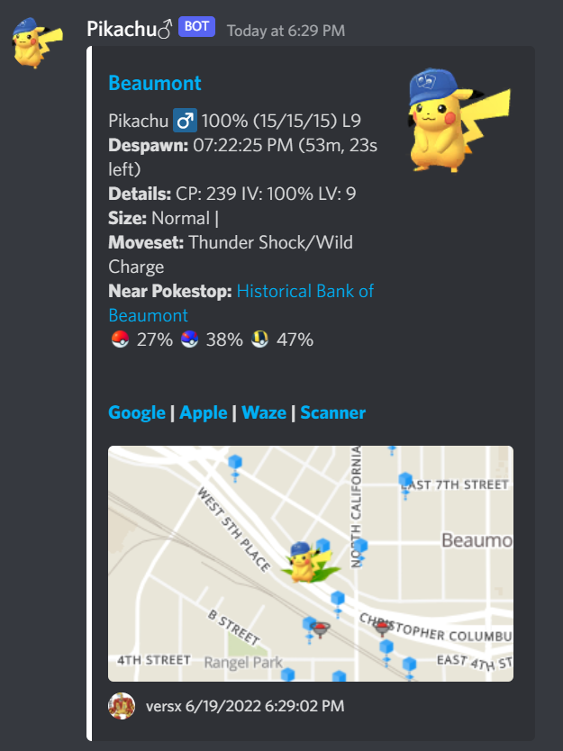
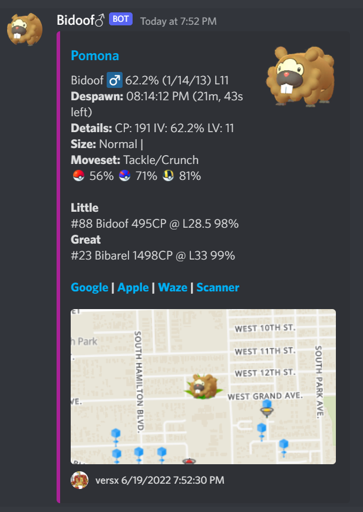
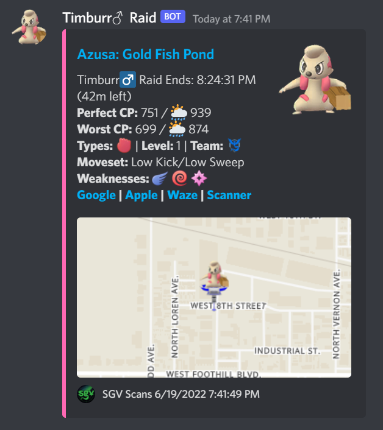
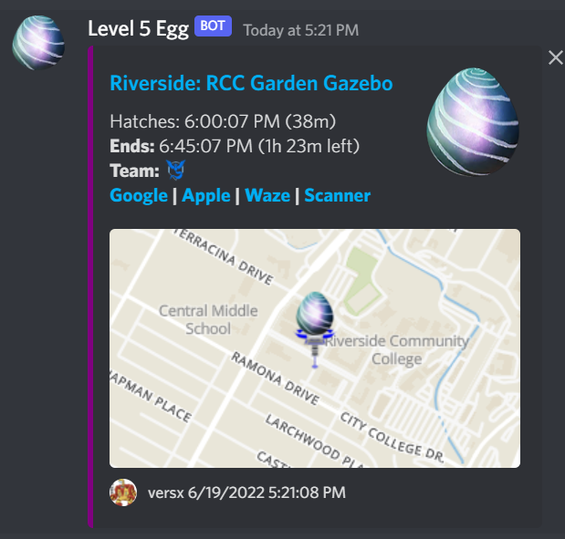
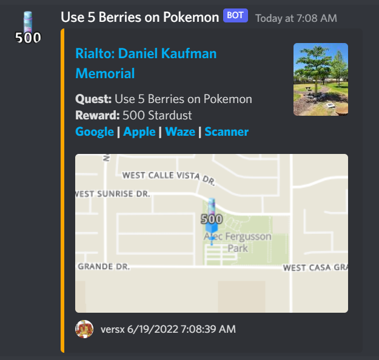
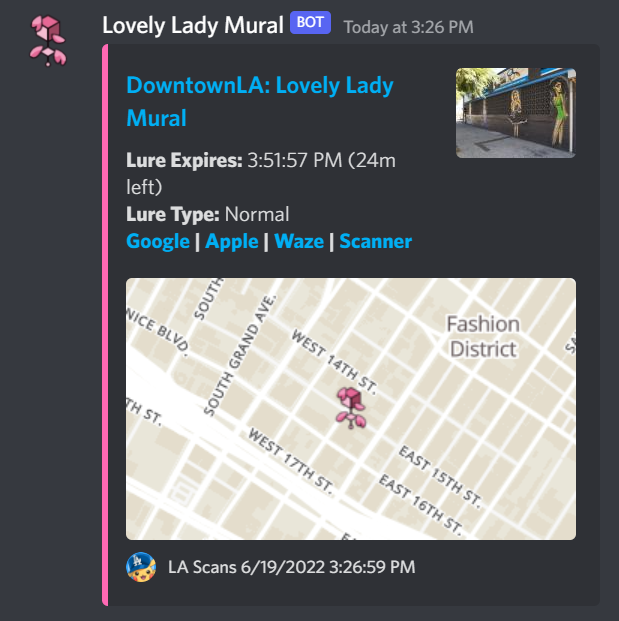
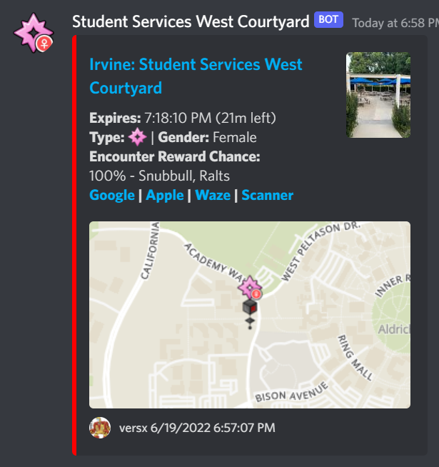

  

# Webhook Manager  

**PokeAlarm, PoracleJS, WDR, Novabot, etc alternative.**  

Works with the following backends:  
- [RealDeviceMap](https://github.com/123FLO321/RealDeviceMap)  
- [Chuck](https://github.com/WatWowMap/Chuck)  
- [ChuckDeviceController](https://github.com/versx/ChuckDeviceController)  

## Description  
Developed in C#, runs on .NET 5.0 ASP.NET CoreCLR utilizing EntityFramework Core. Cross platform compatibility, runs on Windows, macOS, and Linux operating systems.  

Sends Discord notifications based on pre-defined filters for Pokemon, raids, raid eggs, field research quests, Team Rocket invasions, Pokestop lures, gym team changes, and weather changes. It also supports Discord users subscribing to Pokemon, PvP, raid, quest, gym, Team Rocket invasion, and Pokestop lure notifications via direct messages.

### Features  
- Supports multiple Discord servers.  
- Discord channel alarm reports for Pokemon, raids, eggs, quests, lures, invasions, gym team changes, and weather changes.  
- Built-in Admin Dashboard to configure and manage configuration files.  
- Per user custom Discord notifications for Pokemon, raids, quests, invasions, lures, and gyms.  
- User interface to configure custom Discord subscription notifications with ease. [WhMgr-UI](https://github.com/versx/WhMgr-UI)  
- Subscription notifications based on pre-defined distance and geofence areas.  
- Customizable alert messages with dynamic text replacement/substitution.  
- Support for multiple cities/areas using geofences per server.  
- Daily shiny and IV stats reporting.  
- Automatic quest message purge at midnight.  
- Support for Donors/Supporters only custom notifications.  
- Pokemon, PvP, and Raid subscription notifications based on specific forms or costumes.  
- Custom prefix support as well as mentionable bot user string for commands.  
- Raid subscription notifications for specific gyms.  
- Twilio text message alerts for ultra rare Pokemon.  
- Custom image support for Discord alarm reports.  
- Custom icon style selection for Discord user notifications.  
- External emoji server support.  
- Custom static map format support, including pokestop and gym marker placements.  
- Support for language translation per instance (per server planned).  
- Multi threaded, low processing consumption.  
- Rate limit backlog queue.
- [UIcons](https://github.com/uicons/uicons) standard image support.
- Lots more...  

## [Documentation](https://whmgr.rtfd.io/)  

### [Getting Started Guide](https://whmgr.readthedocs.io/en/latest/install/getting-started)  

  

## Previews  
*All examples are completely customizable using Dynamic Text Replacement/Substitution*  

__Pokemon Notifications__  
  

__Pokemon PVP Notifications__  
  

__Raid Boss Notifications__  
  

__Raid Egg Notifications__  
  

__Quest Notifications__  
  

__Lure Notifications__  
  

__Lure (Glacial) Notifications__  
 Notifications")  

__Lure (Mossy) Notifications__  
 Notifications")  

__Lure (Magnetic) Notifications__  
 Notifications")  

__Gym Team Takeover Notifications__  
  

__Team Rocket Invasion Notifications__  
  

__Weather Notifications__  
  

## Credits  
[versx](https://github.com/versx) - Developer  
[PokeAlarm](https://github.com/PokeAlarm/PokeAlarm) - Dynamic Text Substitution idea  
[WDR](https://github.com/PartTimeJS/WDR) - masterfile.json file  
[Contributors](https://github.com/versx/WhMgr/contributors)  